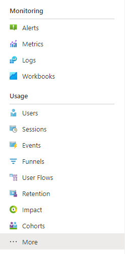

# Bring your own storage to save Workbooks

There are times when you may have a query or some business logic that you want to secure. Workbooks provides an option to secure the workbook by saving the workbook content to your storage which can be encrypted. The storage account is encrypted with Microsoft-managed keys or you can manage the encryption by supplying your own keys. [See Azure documentation](https://docs.microsoft.com/en-us/azure/storage/common/storage-service-encryption)

## Saving Workbook without Identity Setup

1. Create a new workbook.
2. Click on the Save button as before to save the workbook.
    
3. There's an option to `Save content to an Azure Storage Account`, click on the checkbox to save to an Azure Storage Account.
    
4. Select the desire Storage account and Container. The Storage account list is from the Subscription selected above.
    
5. After you've selected your storage options, press `Save` to save your workbook.
6. At this time, workbook will try to save the workbook to the storage but it won't have permission and will popup a dialog box.
    
7. Copy the identity value created for the workbook to be used in step #8. In this example, it's identity `4342ef7d-79db-414d-a4d4-564ca70aeb8a` that is granted permission to the storage account.
8. Bring up the storage account by navigating to the storage account or click on `Go to Access Control Blade` to bring up the storage account container

9. Click `+Add` to Add role assignment and grant the identity copied in step #7, `4342ef7d-79db-414d-a4d4-564ca70aeb8a`, with `Storage Blob Data Contributor` role.

10. Now go back to the save dialog and save again. If you get the error again, you might have to wait until permissions have been applied and then try again. 

## Limitations
+ When a role is added, it may take a few minutes for the permission to propagate.
+ When saving to custom storage, you cannot pin individual parts of the workbook to a dashboard, as the individual pins would contain protected information in the dashboard itself.  When using custom storage, you can only pin links to the workbook itself to dashboards.
+ Once a workbook has been saved to custom storage, it will always be saved to custom storage and this cannot be turned off.  To save elsewhere, you can use "Save As" and elect to not save the copy to custom storage.
+ Workbooks in Application Insights resource are "legacy" workbooks and does not support custom storage. The lastest Workbooks in Application Insights resource is the "...More" selection. Lecacy worbooks doesn't have Subscription options when saving.
  + 