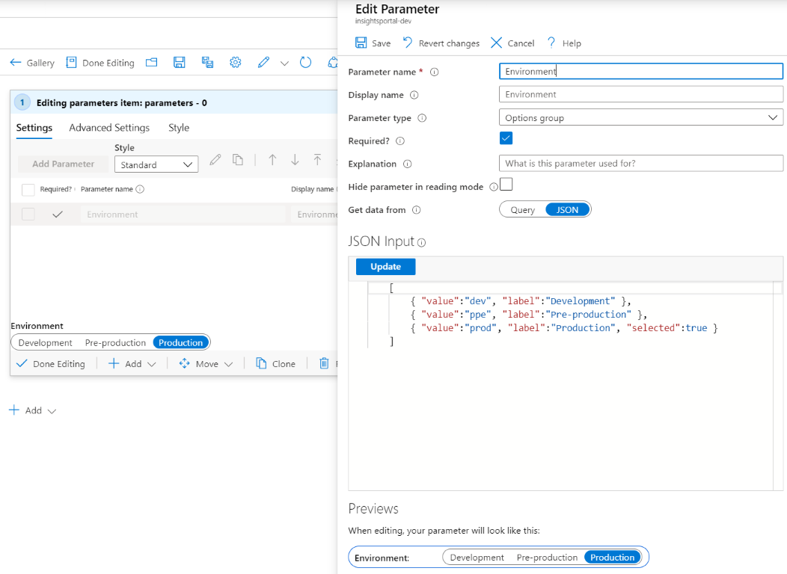

# Options Group Parameters

An options group parameter allows the user to select one values from a known set (e.g. select one of your app’s requests). When there are a small number of values, an options group can be a better choice than a [Drop down](./DropDown.md) parameter, as the user can see all the possible values, and see which one is selected. Options groups are commonly used for yes|no or on|off style choices. When there are large number of possible values, using a drop down is a better choice. Note that unlike drop down parameters, an options group *always* only allows one selected value.

The easiest way to specify the list by providing a static list in the parameter setting. A more interesting way is to get the list dynamically via a KQL query. Parameter setting also allow you to specify whether it is single or multi-select, and if it is multi-select, how the result set should be formatted (delimiter, quotation, etc.).

## Creating a static options group parameter
1. Start with an empty workbook in edit mode.
2. Choose _Add parameters_ from the links within the workbook.
3. Click on the blue _Add Parameter_ button.
4. In the new parameter pane that pops up enter:
    1. Parameter name: `Environment`
    2. Parameter type: `Options Group`
    3. Required: `checked`
    5. Get data from: `JSON`
5. In the JSON Input text block, insert this json snippet:
    ```json
    [
        { "value":"dev", "label":"Development" },
        { "value":"ppe", "label":"Pre-production" },
        { "value":"prod", "label":"Production", "selected":true }
    ]
    ```
    (you are not limited to JSON, you can use any query provider to provide initial values, but will be limited to the first 100 results)
6. Use the blue `Update` button.
7. Choose 'Save' from the toolbar to create the parameter.
8. The Environment parameter will be an options group control with the three values.

   


## Other examples

Query examples and behaviors of the options group parameter the same as the single select drop down parameter samples.

[See also: samples for using the Drop Down parameter](./DropDown.md#Creating_a_dynamic_drop_down_parameter).

