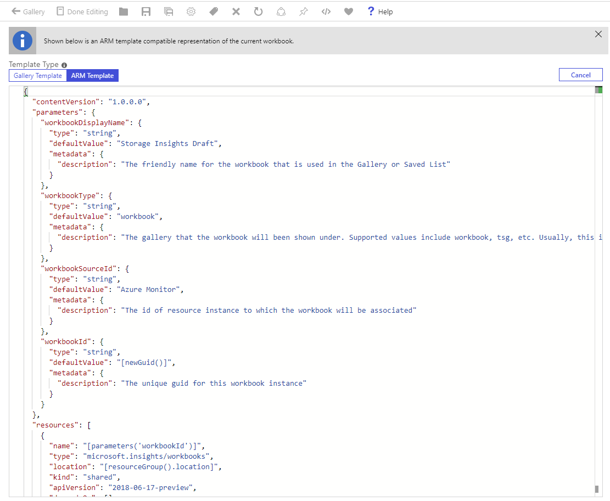

# Programmatically Manage Workbooks

Resource owners have the option to create and manage their workbooks programmatically via ARM templates. 

This can be useful in scenarios like:
1. Deploying org- or domain-specific analytics reports along with resources deployments. For instance, you may deploy org-specific performance and failure workbooks for your new apps or virtual machines.
2. Deploying standard reports or dashboards using workbooks for existing resources.

The workbook will created in the desired sub/resource-group and with the content specified in the ARM templates.

## Creating an ARM template that deploys a Workbook
1. Open a workbook whose content you want to deploy programmatically.
2. Switch the workbook to edit more by clicking on the _Edit_ toolbar item.
3. Open the _Advanced Editor_ using the _</>_ button on the toolbar.
4. In the editor, switch _Template Type_ to _ARM Template_.
5. The ARM template for creating shows up in the editor. Copy the content and use as-is or merge it with a larger template that also deploys the target resource.



## Sample ARM Template
This template show how to deploy a simple workbook that displays a 'Hello World!'
```json
{
    "$schema": "http://schema.management.azure.com/schemas/2015-01-01/deploymentTemplate.json#",
    "contentVersion": "1.0.0.0",
    "parameters": {
        "workbookDisplayName":  {             
            "type":"string",
            "defaultValue": "My Workbook",
            "metadata": {
                "description": "The friendly name for the workbook that is used in the Gallery or Saved List. Needs to be unique in the scope of the resource group and source" 
            }
        },
        "workbookType":  {             
            "type":"string",
            "defaultValue": "tsg",
            "metadata": {
                "description": "The gallery that the workbook will been shown under. Supported values include workbook, tsg, Azure Monitor, etc." 
            }
        },
        "workbookSourceId":  {             
            "type":"string",
            "defaultValue": "<insert-your-resource-id-here>",
            "metadata": {
                "description": "The id of resource instance to which the workbook will be associated" 
            }
        },
        "workbookId": {
            "type":"string",
            "defaultValue": "[newGuid()]",
            "metadata": {
                "description": "The unique guid for this workbook instance" 
            }
        }
    },    
    "resources": [
        {
            "name": "[parameters('workbookId')]",
            "type": "Microsoft.Insights/workbooks",
            "location": "[resourceGroup().location]",
            "kind": "shared",
            "apiVersion": "2018-06-17-preview",
            "dependsOn": [],
            "properties": {
                "displayName": "[parameters('workbookDisplayName')]",
                "serializedData": "{\"version\":\"Notebook/1.0\",\"items\":[{\"type\":1,\"content\":\"{\\\"json\\\":\\\"Hello World!\\\"}\",\"conditionalVisibility\":null}],\"isLocked\":false}",
                "version": "1.0",
                "sourceId": "[parameters('workbookSourceId')]",
                "category": "[parameters('workbookType')]"
            }
        }
    ],
    "outputs": {
        "workbookId": {
            "type": "string",
            "value": "[resourceId( 'Microsoft.Insights/workbooks', parameters('workbookId'))]"
        }
    }
}
```

### Template Parameters

| Parameter | Explanation |
| :------------- |:-------------|
| `workbookDisplayName` | The friendly name for the workbook that is used in the Gallery or Saved List. Needs to be unique in the scope of the resource group and source |
| `workbookType` | The gallery that the workbook will been shown under. Supported values include workbook, tsg, Azure Monitor, etc. |
| `workbookSourceId` | The id of resource instance to which the workbook will be associated. The new workbook will show up related to this resource instances - for example in the resource's table of content under _Workbook_. If you want your workbook to show up in the workbook gallery in Azure Monitor, use the string _Azure Monitor_ instead of a resource id. |
| `workbookId` | The unique guid for this workbook instance. Use _[newGuid()]_ to automatically create a new guid. |
| `kind` | Used to specify if the created workbook is shared or private. Use value _shared_ for shared workbooks and _user_ for private ones. |
| `location` | The Azure location where the workbook will be created. Use _[resourceGroup().location]_ to create it in the same location as the resource group |
| `serializedData` | Contains the content or payload to be used in the workbook. Use the ARM template from the workbooks UI to get the value |

### Workbook Types
Workbook types specify which workbook gallery type the new workbook instance will show up under. Options include:

| Type | Gallery location |
| :------------- |:-------------|
| `workbook` | The default used in most reports, including the Workbooks gallery of Application Insights, Azure Monitor, etc.  |
| `tsg` | The Troubleshooting Guides gallery in Application Insights |
| `usage` | The _More_ gallery under _Usage_ in Application Insights |

### Limitations
For an technical reason, this mechanism cannot be used to create workbook instances in the _Workbooks_ gallery of Application Insights. We are working on addressing this limitation. In the meanwhile, we recommend that you use the Troubleshooting Guide gallery (workbookType: _tsg_) to deploy Application Insights related workbooks.