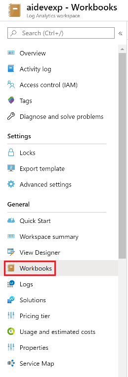
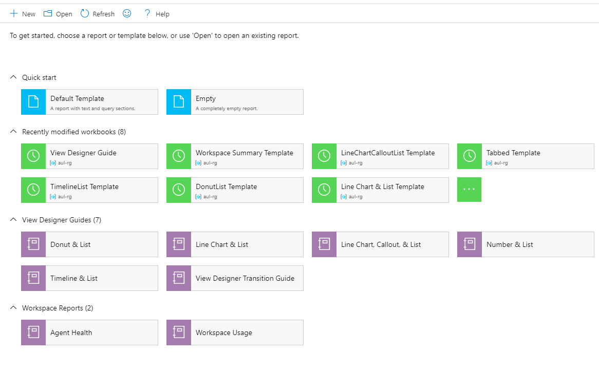

# Accessing Workbooks & Viewing Permissions

### Jump to a section
* [Accessing and Managing Views with Workbooks](#Access)
* [Creating your Workspace Summary](#Dashboard)
* [Sharing and Viewing Permissions](#Share)

## Accessing and Managing Views with Workbooks 
Workbooks are enabled in Log Analytics workspaces as an item in the side navigation bar, directly under the View Designer location

While View Designer manages views through the Workspace summary, Workbooks utilizes a gallery that displays saved workbooks and templates for your workspace. Users can utilize the gallery as a gateway for accessing, modifying, and creating views.

To start a new workbook, you may select the Empty template under Quick start, or the + New icon in the top navigation bar. To view templates or return to saved workbooks, select the item from the gallery or search for the name in the search bar.

To save a workbook, you will need to save the report with a specific title, subscription, resource group, and location.
The workbook will auto-fill to the same settings as the LA workspace, with the same subscription, resource group, however, users may change these report settings. Workbooks are by default saved to 'My Reports', accessible only by the individual user. But can be saved directly to shared reports or shared later on.

## Creating your Workspace Summary 
To maintain a visual overview like the View Designer Workspace Summary, Workbooks offers pinned steps, which can be pinned to your [Azure Portal Dashboard](https://docs.microsoft.com/en-us/azure/azure-portal/azure-portal-dashboards).

Create a new Azure Dashboard or select an existing Azure Dashboard to begin pinning Workbooks items.
 
View Designer users may be familiar with having an overview tile to represent a set of views. Workbooks allows you to pin a single or multiple visualizations to Azure Dashboards to recreate the look and feel of the Workspace Summary.

 
To pin individual item, you will need to enable the pin icon for your specific step. To do so, select the corresponding `↑ Edit` button for your step, then select the `⚙️` to open the `Advanced Settings`. Check the option to "Always show the pin icon on this step", and a pin icon will appear in the upper right hand corner of your step. This pin enables you to pin specific visualizations to your dashboard, just like the overview tiles.
 
Users may also wish to pin multiple visualizations from the Workbook or the entire Workbook content to a dashboard. To pin the entire workbook, select `🖊️ Edit` in the top toolbar to toggle the `Edit Mode`. A 📌 (pin) icon will appear, allowing you to either pin the entire Workbook item or all of the individual steps and visualizations within the workbook.

## Sharing and Viewing Permissions 
