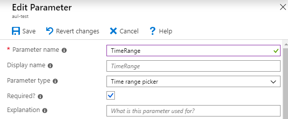
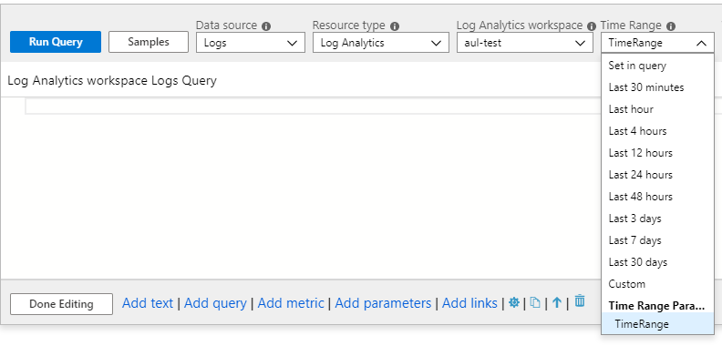
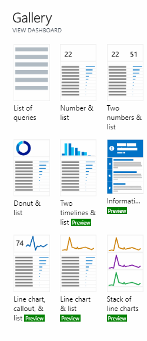
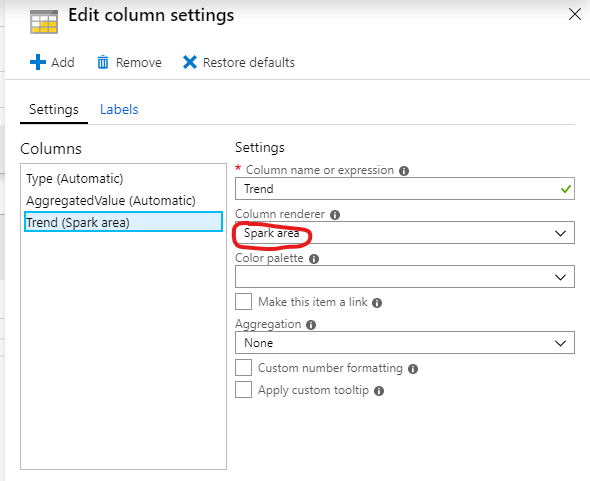
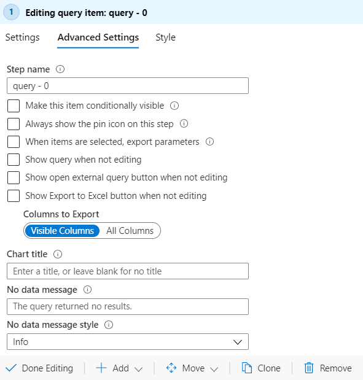
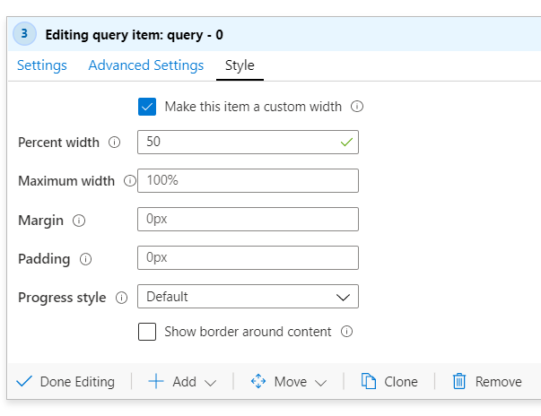
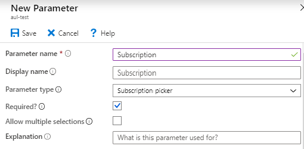
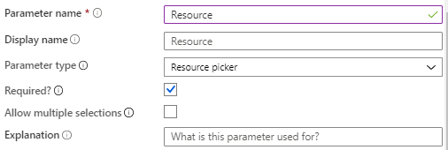
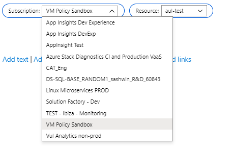

# Common Steps

## Quick Start with preset View Designer Templates

Workbooks in LA workspaces already have templates made to match some of the views in View Designer. Select the "View Designer Transition Guide" to learn about your options or select one of the many preset templates.

[Click here](https://portal.azure.com/#blade/HubsExtension/BrowseResourceBlade/resourceType/Microsoft.OperationalInsights%2Fworkspaces) to view your Log Analytics workspaces and get started with Workbooks.

## Enabling Time Range Filter
View Designer has a built-in default Time Range filter, however, in Workbooks this setting is not enabled by default. Workbooks does allow users to create their own Time Range filters that might be more applicable to their data logs. The steps to generate the filter are listed below:

Select the **Add parameters** option

The default Style is set to **Pills**

Select the **Add Parameter** button

From the sidebar menu, in the **Parameter name** textbox, type “TimeRange”

Set **Parameter Type** as “Time Range Picker”

Select the “Required?” checkbox

Save the parameter in the upper left hand corner of the sidebar menu

You can leave the dropdown as “unset” by default or select a default TimeRange value, such as 24 hours.

Select **Done Editing**

Parameters can be utilized in queries by adding curly braces {} around your parameter name.

More details on parameters can be found in the [Workbooks Documentation on Parameters](https://github.com/microsoft/Application-Insights-Workbooks/blob/master/Documentation/Parameters/Parameters.md).

## Updating Queries for with the TimeRange Parameter
**Option 1: Select TimeRange from the Time Range Dropdown for each query**

**Option 2: Update your KQL queries**

Within your query add this line: _| where TimeGenerated {TimeRange}_

**Example:**

**Original:** _search * | summarize count() by Type_

**Updated:** _search * **| where TimeGenerated {TimeRange}** | summarize count() by Type_

## Including a List
Most of the View Designer views include a list, this standard list can be re-produced utilizing the following steps.

You will need to add a visualization by clicking **Add query** from the cell options

View Designer employs a default query that matches the syntax from the Original example. This can be updated by changing the query to the updated form.

**Original:** _search * | summarize **AggregatedValue** = count() by Type_\
**Updated:** _search * | summarize **Count** = count() by Type_

This will generate a list that looks similar to the following:

## Enabling Sparklines
A common feature for grids is to add sparklines to summarize various data patterns over time. View Designer offers the Enable Sparklines feature for all lists, as does Workbooks.

To include Sparklines in your data that match View Designer, you will need to join the data with your original query. You will need to add the following line

_| join kind = inner (search * \
| make-series Trend = count() default=0 on TimeGenerated from \{TimeRange:start} to {TimeRange:end} step {TimeRange:grain} by Type)\
on Type_

Then under **Column Settings**

Update the **Column renderer** dropdown to be a Spark area

Then save the settings and re-running the query will now update your table to include a Sparkline

Example:\
**Original:**\
_search *\
| summarize AggregatedValue = count() by Type) on Type_\
**Updated:**\
_search *\
| summarize AggregatedValue = count() by Type\
**| join kind = inner (search * \
| make-series Trend = count() default=0 on TimeGenerated from \{TimeRange:start} to {TimeRange:end} step {TimeRange:grain} by Type\
) on Type\
| project Type, AggregatedValue, Trend**_\

Resulting grid will look similar to below:

## Advanced Cell Settings
To mirror View Designer, some common steps such as changing the size of Workbook cells or adding pins and external links to logs might be utilized.

To access Advanced Settings select the gear icon at the bottom of each cell

This will bring up a menu with various options

To add a pin and a link to an external query simply select the corresponding checkboxes.

To add a title to your cell, simply type the desired title into the **Chart title** section.

By default any Workbooks cell is set to take up the entire page width, but users can adjust this by scaling the cell down, by clicking under the **Style** tab of the Advanced Settings menu

 
## Additional Parameters

Similar to the TimeRange Filter, you select **Add Parameter**
For selecting a Subscription, type “Subscription” into the **Parameter name** field in the side menu and select “Subscription Picker” from the **Parameter type** dropdown

For selecting a Resource, type “Resource” into the **Parameter name** field 
in the side menu and select “Resource Picker” from the **Parameter type** dropdown

This will insert dropdowns to let you access your various subscriptions and resources

### [Next Section: Tile Conversions](./TileConversions.md)
