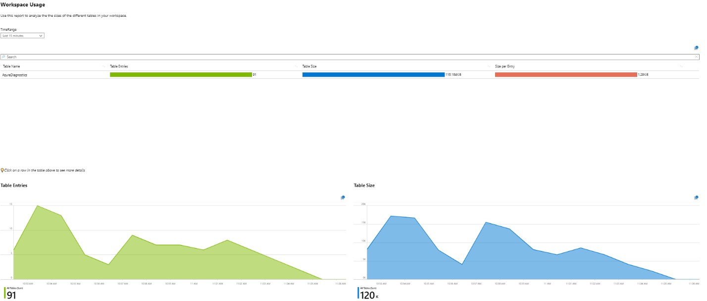

# View Designer to Workbooks Transition Guide

## Table of Contents
- Overview
- [Conversion Options](./ConversionOptions.md)
- [Common Steps](./CommonSteps.md)
- [Tile Conversions](./TileConversions.md)

## View Designer Overview
View Designer is a tool offered through Azure Monitor. View Designer allows you to create custom views to help you visualize data in your Log Analytics workspace, with charts, lists, and timelines. 

Link to additional [View Designer Resources](https://docs.microsoft.com/en-us/azure/azure-monitor/platform/view-designer)

## Workbooks Overview
Workbooks combine text, [log queries](https://docs.microsoft.com/en-us/azure/azure-monitor/log-query/query-language), metrics, and parameters into rich interactive reports. Team members with the same access to Azure resources are also able to edit Workbooks.

Workbooks are helpful for scenarios such as:

- 	Exploring the usage of your virtual machine when you don't know the metrics of interest in advance: CPU utilization, disk space, memory, network dependencies, etc. Unlike other usage analytics tools, workbooks let you combine multiple kinds of visualizations and analyses, making them great for this kind of free-form exploration.
-	Explaining to your team how a recently provisioned VM is performing, by showing metrics for key counters and other log events.
-	Sharing the results of a resizing experiment of your VM with other members of your team. You can explain the goals for the experiment with text, then show each usage metric and analytics queries used to evaluate the experiment, along with clear call-outs for whether each metric was above- or below-target.
-	Reporting the impact of an outage on the usage of your VM, combining data, text explanation, and a discussion of next steps to prevent outages in the future.

Link to additional [Workbook Resources](https://docs.microsoft.com/en-us/azure/azure-monitor/insights/vminsights-workbooks)

## Why Convert View Designer Dashboards to Workbooks?

View Designer offers the ability to generate different query-based views and visualizations. However, many high-level customizations remain limited, such as formatting the grids and tile layouts or selecting alternative graphics to represent your data. View Designer is restricted to a total of 9 distinct tiles to represent your data.

Workbooks is a platform that unlocks the full potential of your data. Workbooks not only retains all the capabilities, but also supports additional functionality through text, metrics, parameters, and much more. For example, Workbooks allows users to consolidate dense grids and add search bars to easily filter and analyze the data. 

While this guide offers simple steps to directly recreate several of the commonly used View Designer views, Workbooks allows users to have the freedom to create and design any of their own custom visualizations and metrics. Below is a snapshot of what Workbooks is capable of creating:

[Workspace usage template from Workbooks](https://go.microsoft.com/fwlink/?linkid=874159&resourceId=Azure%20Monitor&featureName=Workbooks&itemId=community-Workbooks%2FAzure%20Monitor%20-%20Workspaces%2FWorkspace%20Usage&workbookTemplateName=Workspace%20Usage&func=NavigateToPortalFeature&type=workbook)

## How to Start using Workbooks
Workbooks are enabled in Log Analytics workspaces as an item in the side navigation bar, directly under the View Designer location

While View Designer manages views through the Workspace summary, Workbooks utilizes a gallery that displays saved workbooks and templates for your workspace.

To start a new workbook, you may select the Empty template under Quick start, or the New icon in the top navigation bar. To view templates or return to saved workbooks, select the item from the gallery or search for the name in the search bar.

To save a workbook, you will need to save the report with a specific title, subscription, resource group, and location.
The workbook will auto-fill to the same settings as the LA workspace, with the same subscription, resource group, however, users may change these report settings. Workbooks are by default saved to 'My Reports', accessible only by the individual user. But can be saved directly to shared reports or shared later on.

### [Next Section: Conversion Options](./ConversionOptions.md)
