# Composite Bar Renderer

Workbook allows rendering data using composite bar, a bar made up of multiple bars.

The image below shows the composite bar for database status representing how many servers are online, offline, and in recovering state.

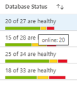

Composite bar renderer is supported for Grids, Tiles, and Graphs Visualizations

## Adding composite bar renderer
1. Switch the workbook to edit mode by clicking on the _Edit_ toolbar item.
2. Use the _Add query_ link.
3. Set data source to JSON and visualization to Grid.
4. Add following JSON data

```
[
    {"sub":"X", "server": "A", "online": 20, "recovering": 3, "offline": 4, "total": 27},
    {"sub":"X", "server": "B", "online": 15, "recovering": 8, "offline": 5, "total": 28},
    {"sub":"Y", "server": "C", "online": 25, "recovering": 4, "offline": 5, "total": 34},
    {"sub":"Y", "server": "D", "online": 18, "recovering": 6, "offline": 9, "total": 33}
]
```
5. Click on "Column Settings" to open the settings.
6. Click on "total" column and choose Column renderer as "Composite Bar".
7. Set following settings under Composite Bar Settings.

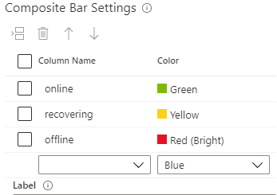

8. Add Label: ["online"] of ["total"] are healthy
9. Set renderer as Hidden for online, offline, and recovering columns (Optional).
9. Go to Labels and update label for "total" column as "Database Status" (Optional).
9. Click on "Apply".


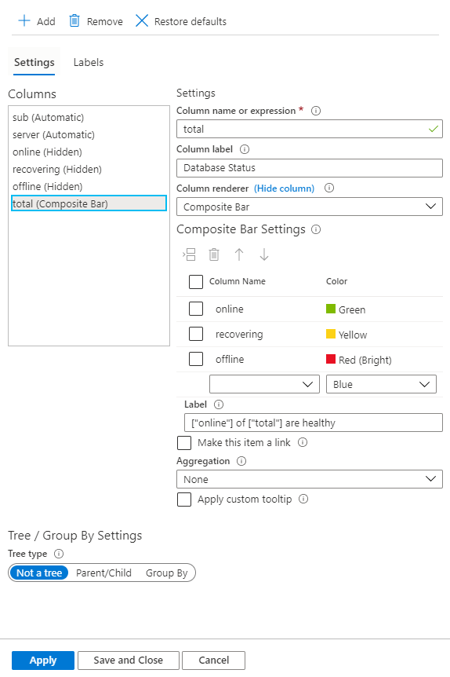


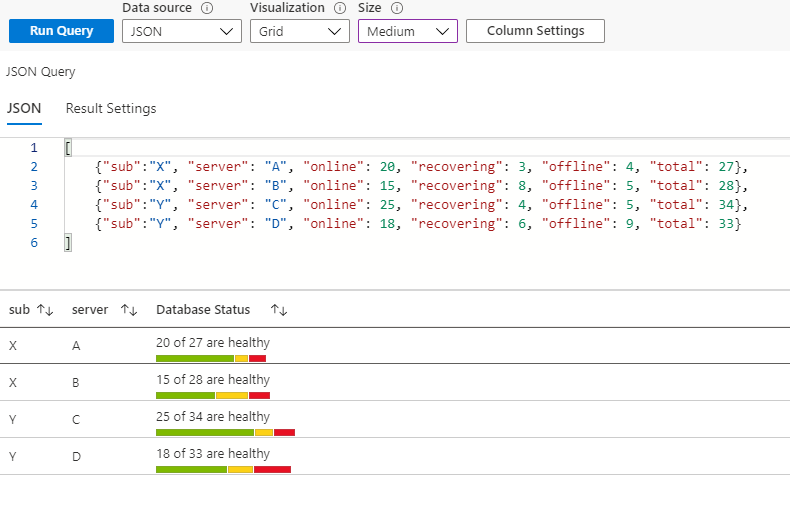

## Composite Bar Settings

Select column name and corresponding color to render that column in that color as a part of composite bar. You can insert, delete, move rows up and down.

### Label

Composite bar label is displayed at the top of the composite bar. You can use a mix of static text, columns, and parameters. If Label is empty, the value of the current columns is displayed as label ex. in above example the value of total columns is displayed if label field is blank.

Refer column as ["columnName"]

Refer parameters as {paramName}

Both column name and parameter name are case sensitive.

You can also make label as a link by selecting "Make this item as a link" and then add Link settings.

### Aggregation

Aggregations are useful for Tree/Group By visualizations. The data for a column for the group row is decided by the aggregation set for that column. There are three types of aggregations applicable for composite bars: None, Sum, and Inherit.

Add Group By settings like this:

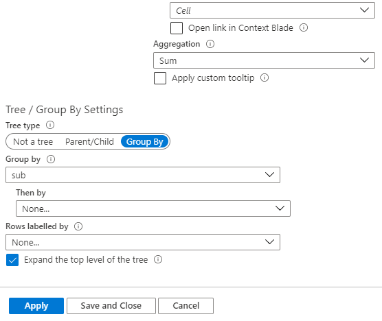

#### None
None aggregation means display no results for that column for the group rows


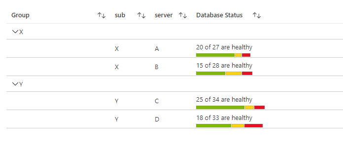

#### Sum
If aggregation is set as Sum, then the column in the group row will show the composite bar by using the sum of the columns used to render it. The label will also use the sum of the columns referred in it.

In below example, the online, offline, and the recovering, all have Max aggregation set to them and the aggregation for total column is Sum.

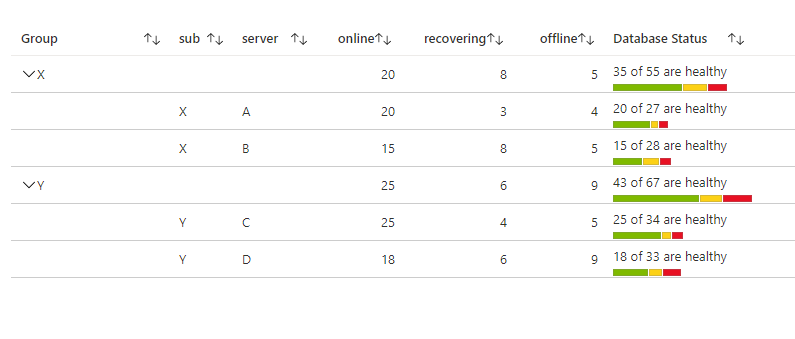

#### Inherit
If aggregation is set as Inherit, then the column in the group row will show the composite bar by using the aggregation set by users for the columns used to render it. The columns used in label also use the aggregation set by user. If current column having renderer as composite bar is referred in label (like "total" in above example) then "Sum" is used as aggregation for that column.

In below example, the online, offline, and the recovering, all have Max aggregation set to them and the aggregation for total column is Inherit.

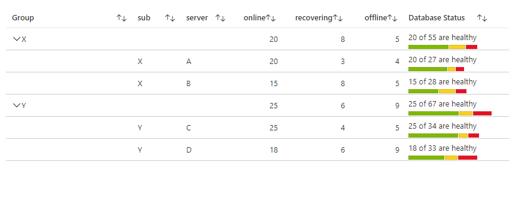

#### Custom Tooltip

Select "Apply custom tooltip" and add a custom tooltip which acts as a tooltip for the label.

## Sorting

For Grid Visualization, the sorting of the rows for the column having the composite bar renderer works based on the value that is the sum of the columns used to render the composite bar, computed dynamically. In above examples, the value used for sorting is the sum of the online, recovering, and the offline columns for that particular row.

## Tiles visualization

The following images show the settings for composite bar renderer for Tiles visualization and the final result using the same JSON data mentioned above.

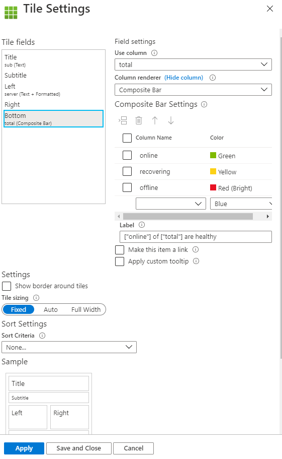


## Graphs visualization

The following images show the settings for composite bar renderer for Graphs visualization(type Hive Clusters) and the final result using the same JSON data mentioned above.

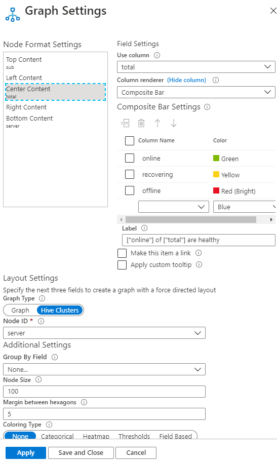


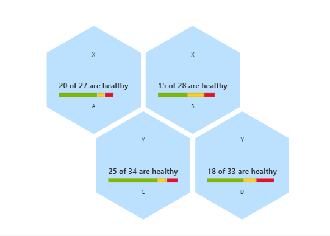