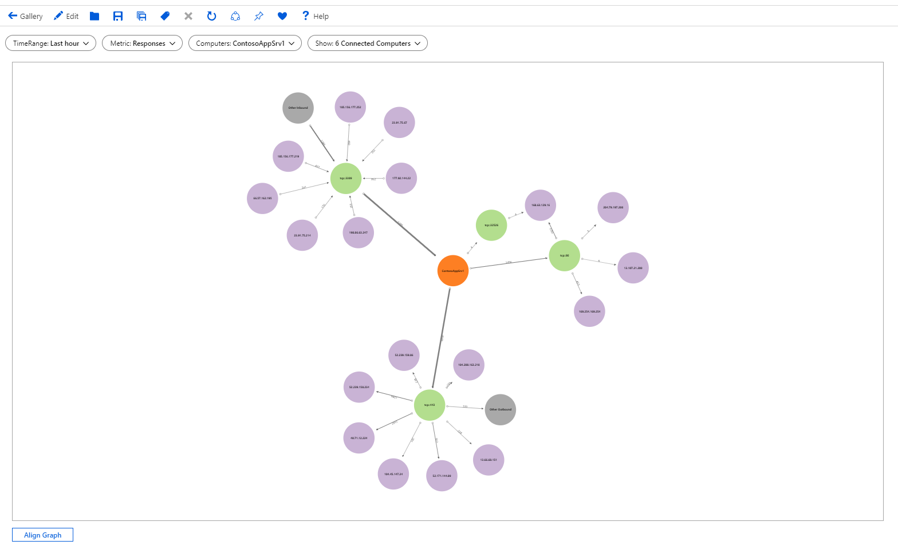
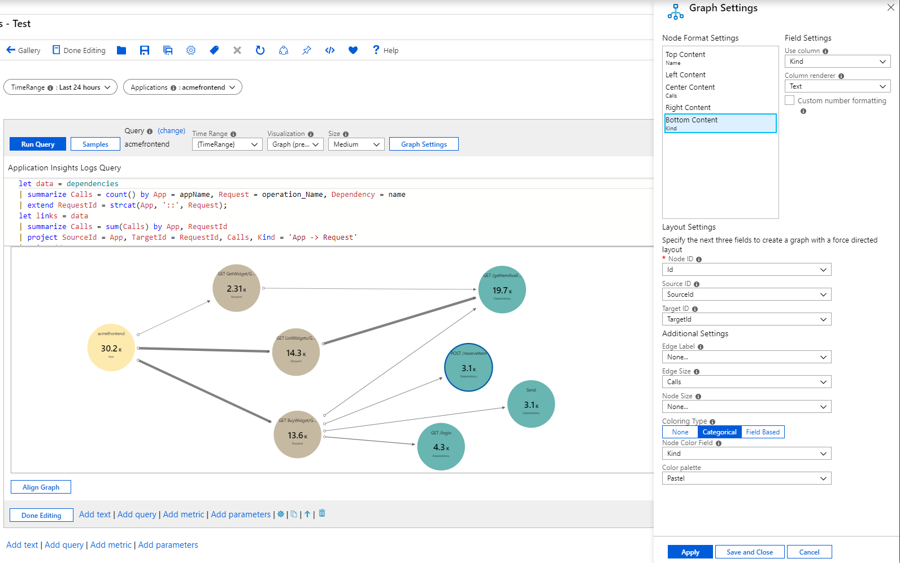
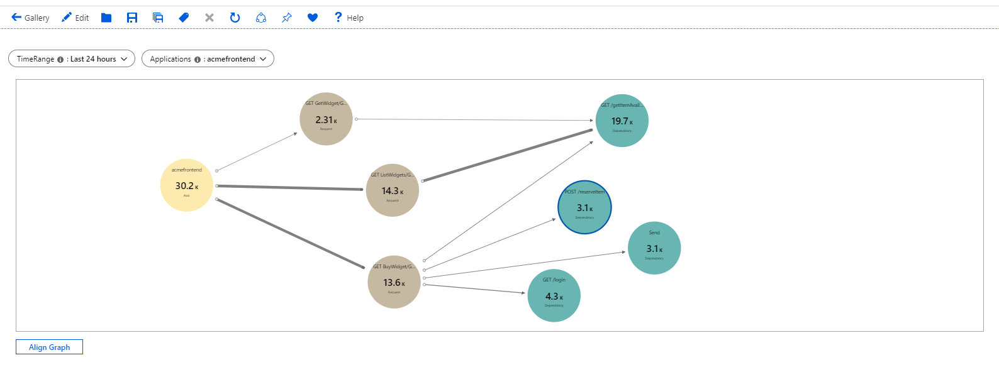
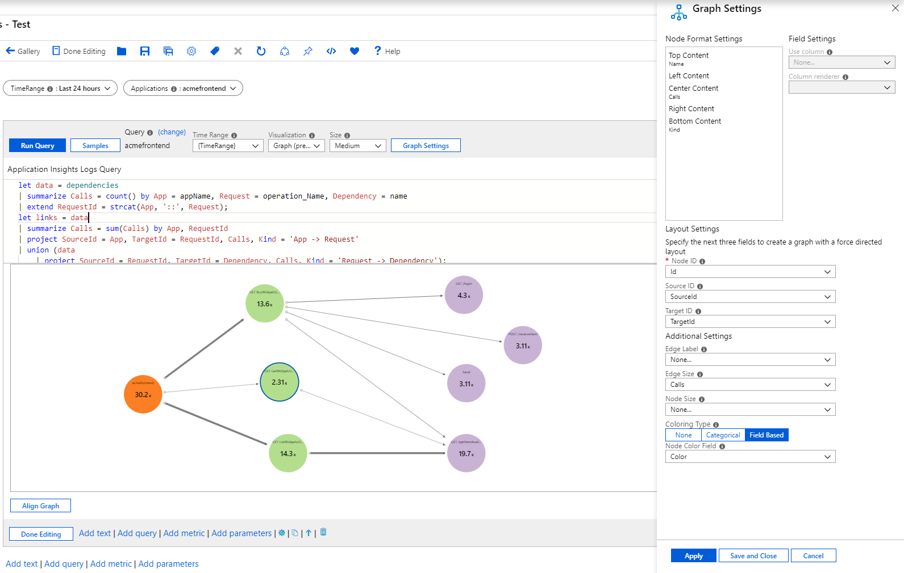

# Graph Visualization

Workbooks supports visualizing arbitrary graphs based on data from logs to show the relationships between monitoring entities. 

The graph below show data flowing in/out of a computer via various port to/from external computers. It is colored by type (computer vs. port vs. external i/p) and the edge sizes correspond to the amount of data flowing in-between. The underlying data comes from KQL query targeting VM connections.



## Adding a Graph
1. Switch the workbook to edit mode by clicking on the _Edit_ toolbar item.
2. Use the _Add query_ link to add a log query control to the workbook. 
3. Select the query type as _Log_, resource type (e.g. Application Insights) and the resources to target.
4. Use the Query editor to enter the KQL for your analysis
    ```
    let data = dependencies
    | summarize Calls = count() by App = appName, Request = operation_Name, Dependency = name
    | extend RequestId = strcat(App, '::', Request);
    let links = data
    | summarize Calls = sum(Calls) by App, RequestId
    | project SourceId = App, TargetId = RequestId, Calls, Kind = 'App -> Request'
    | union (data
        | project SourceId = RequestId, TargetId = Dependency, Calls, Kind = 'Request -> Dependency');
    let nodes = data
    | summarize Calls = sum(Calls) by App
    | project Id = App, Name = App, Calls, Kind = 'App'
    | union (data
        | summarize Calls = sum(Calls) by RequestId, Request
        | project Id = RequestId, Name = Request, Calls, Kind = 'Request')
    | union (data
        | summarize Calls = sum(Calls) by Dependency
        | project Id = Dependency, Name = Dependency, Calls, Kind = 'Dependency');
    nodes
    | union (links)
    ```
7. Set the visualization to _Graph_
8. Click the _Graph Settings_ button to open the settings pane
9. In _Layout Fields_ at the bottom, set:
    1. Node Id: `Id`
    2. Source Id: `SourceId`
    3. Target Id: `TargetId`
    4. Edge Label: `None`
    5. Edge Size: `Calls`
    6. Node Size: `None`
    7. Coloring Type: `Categorical`
    8. Node Color Field: `Kind`
    9. Color palette: `Pastel`
10. In _Node Format Settings_ at the top, set:
    1. _Top Content_- Use Column: `Name`, Column Renderer: `Text`
    2. _Center Content_- Use Column: `Calls`, Column Renderer: `Big Number`, Color Palette: `None`
    3. _Bottom Content_- Use Column: `Kind`, Column Renderer: `Text`
10. Click the _Save and Close_ button at the bottom of the pane.



This is how the graph will look like in read mode:



## Graph Settings

| Setting | Explanation |
|:------------- |:-------------|
| `Node Id` | Selects a column that provides the unique id of nodes on the graph. Value of the column can be string or a number |
| `Source Id` | Selects a column that provides the ids of source nodes for edges on the graph. Values must map to a value in the _Node Id_ column |
| `Source Id` | Selects a column that provides the ids of target nodes for edges on the graph. Values must map to a value in the _Node Id_ column |
| `Edge Label` | Selects a column that provides edge labels on the graph |
| `Edge Size` | Selects a column that provides the metric on which the edge widths will be based on |
| `Node Size` | Selects a column that provides the metric on which the node areas will be based on |
| `Coloring Type` | Used to choose the node coloring scheme |

## Node Coloring Types

| Coloring Type | Explanation |
|:------------- |:-------------|
| `None` | All nodes have the same color |
| `Categorical` | Nodes are assigned colors based on the value or category from a column in the result set. In the example above, the coloring is based on the column _Kind_ of the result set. Supported palettes are `Default`, `Pastel` and `Cool tone`  |
| `Field Based` | In this type, a column provides specific RGB values to use for the node. Provides the most flexibility but usually requires more work to enable.  |

## Node Format Settings
Graph authors can specify what content goes to the different parts of a node - top, left, center, right and bottom. They are free to use any of renderers workbook supports (text, big number, spark lines, icon, etc.)

## Field Based Node Coloring

1. Switch the workbook to edit mode by clicking on the _Edit_ toolbar item.
2. Use the _Add query_ link to add a log query control to the workbook. 
3. Select the query type as _Log_, resource type (e.g. Application Insights) and the resources to target.
4. Use the Query editor to enter the KQL for your analysis
    ```
    let data = dependencies
    | summarize Calls = count() by App = appName, Request = operation_Name, Dependency = name
    | extend RequestId = strcat(App, '::', Request);
    let links = data
    | summarize Calls = sum(Calls) by App, RequestId
    | project SourceId = App, TargetId = RequestId, Calls, Kind = 'App -> Request'
    | union (data
        | project SourceId = RequestId, TargetId = Dependency, Calls, Kind = 'Request -> Dependency');
    let nodes = data
    | summarize Calls = sum(Calls) by App
    | project Id = App, Name = App, Calls, Color = 'FD7F23'
    | union (data
        | summarize Calls = sum(Calls) by RequestId, Request
        | project Id = RequestId, Name = Request, Calls, Color = 'B3DE8E')
    | union (data
        | summarize Calls = sum(Calls) by Dependency
        | project Id = Dependency, Name = Dependency, Calls, Color = 'C9B3D5');
    nodes
    | union (links)
    ```
7. Set the visualization to _Graph_
8. Click the _Graph Settings_ button to open the settings pane
9. In _Layout Fields_ at the bottom, set:
    1. Node Id: `Id`
    2. Source Id: `SourceId`
    3. Target Id: `TargetId`
    4. Edge Label: `None`
    5. Edge Size: `Calls`
    6. Node Size: `None`
    7. Coloring Type: `Field Based`
    8. Node Color Field: `Color`
10. In _Node Format Settings_ at the top, set:
    1. _Top Content_- Use Column: `Name`, Column Renderer: `Text`
    2. _Center Content_- Use Column: `Calls`, Column Renderer: `Big Number`, Color Palette: `None`
    3. _Bottom Content_- Use Column: `Kind`, Column Renderer: `Text`
10. Click the _Save and Close_ button at the bottom of the pane.




*Graphs also support Composite bar renderers. Refer [Composite Bar](./CompositeBar.md) for details*
