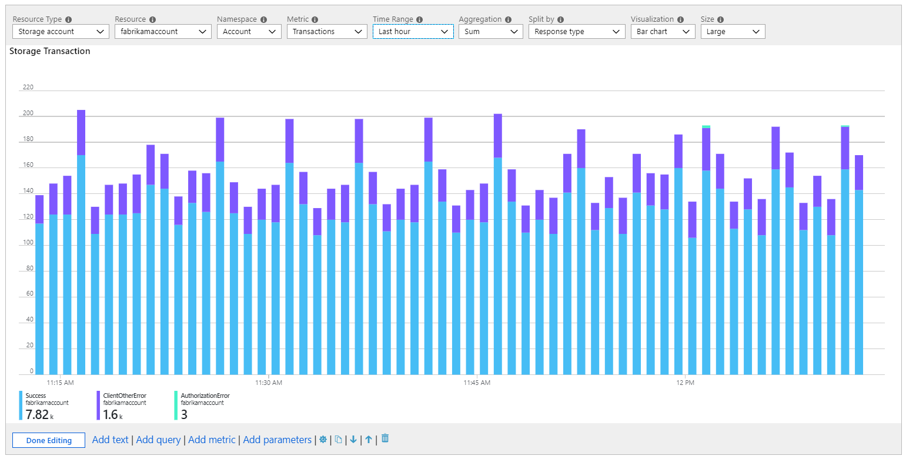

# Metric Charts

Most Azure resources emit metric data about state and health (e.g. CPU utilization, storage availability, count of database transactions, failing app requests, etc). Workbooks allow the visualization of this data as time-series charts. 

The example below shows the number of transactions in a storage account over the prior hour. This allows the storage owner to see the transaction trend and look for anomalies in behavior.  

## Adding a metric chart
1. Switch the workbook to edit more by clicking on the _Edit_ toolbar item.
2. Use the _Add metric_ link to add a metric control to the workbook. 
3. Select a resource type (e.g. Storage Account), the resources to target, the metric namespace and name, and the aggregation to use.
4. Set other parameters if needed - like time range, split-by, visualization, size and color palette. 

Here is the edit mode version of the metric chart above:

## Metric chart parameters

| Parameter | Explanation | Example |
| ------------- |:-------------|:-------------|
| `Resource Type` | The resource type to target | Storage or Virtual Machine. |
| `Resources` | A set of resources to get the metrics value from | MyStorage1 |
| `Namespace` | The namespace with the metric | Storage > Blob |
| `Metric` | The metric to visualize | Storage > Blob > Transactions |
| `Aggregation` | The aggregation function to apply to the metric | Sum, Count, Average, etc. |
| `Time Range` | The time window to view the metric in | Last hour, Last 24 hours, etc. |
| `Visualization` | The visualization to use | Area, Bar, Line, Scatter, Grid |
| `Split By` | Optionally split the metric on a dimension | Transactions by Geo type |
| `Size` | The vertical size of the control | Small, medium or large |
| `Color palette` | The color palette to use in the chart. Ignored if the `Split by` parameter is used | Blue, green, red, etc. |

## Examples
### Transactions Split by API Name as a Line Chart

### Transactions Split by Response type as a large Bar Chart

### Average Latency as a Scatter Chart

