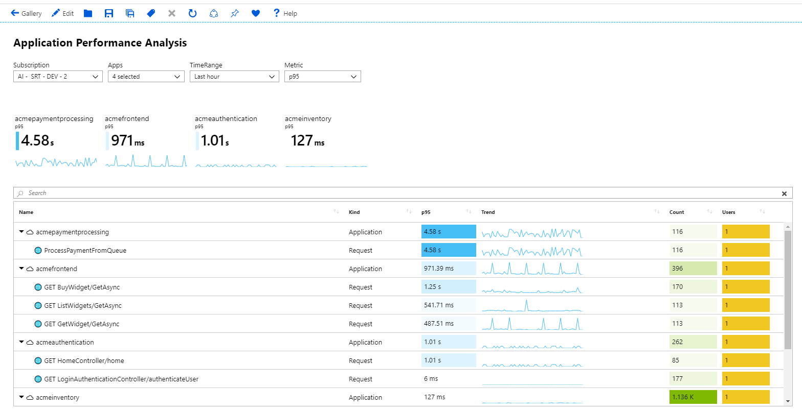
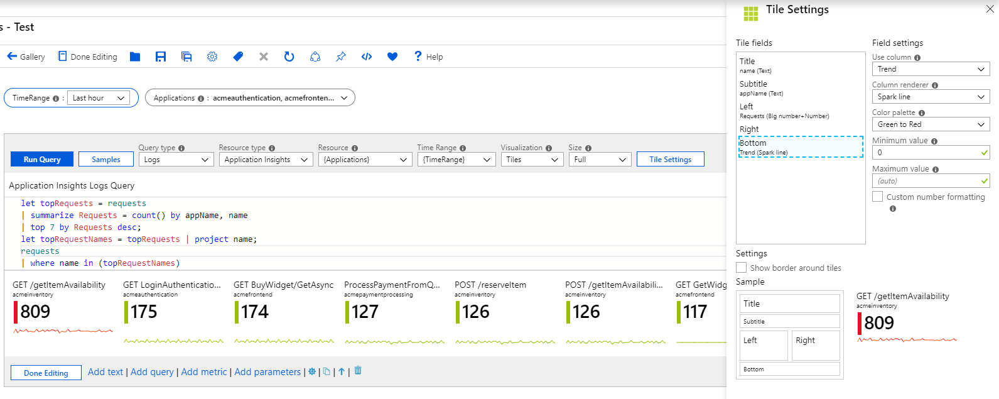

# Tile Visualization

Tiles are a very useful way to present summary data in workbooks. The image below shows a common use case of tiles - app level summary on top of a detailed grid.  



Workbook tiles support showing a title, subtitle, large text, icons, metric based gradients, spark line/bars, footer, etc. 

## Adding a Tile
1. Switch the workbook to edit more by clicking on the _Edit_ toolbar item.
2. Use the _Add query_ link to add a log query control to the workbook. 
3. Select the query type as _Log_, resource type (e.g. Application Insights) and the resources to target.
4. Use the Query editor to enter the KQL for your analysis
    ```
    requests
    | summarize Requests = count() by appName, name
    | top 7 by Requests desc
    ```
5. Set Size to _Full_
6. Set the visualization to _Tiles_
7. Click the _Tile Settings_ button to open the settings pane
8. In _Tile Fields_, set:
    1. Title: `name`
    2. Left: `Requests`, Renderer: `Big Number`, Color Palette: `Green to Red`, Min Value: `0`
    3. Bottom: `appName`
8. Click the _Save and Close_ button at the bottom of the pane.


This is how the tiles will look like in read mode:


## Spark lines in Tiles
1. Create a query control using steps 1-3 above.
2. Add a time range parameter called _TimeRange_ above the query control.
3. Use the Query editor to enter the KQL for your analysis
    ```
    let topRequests = requests
    | summarize Requests = count() by appName, name
    | top 7 by Requests desc;
    let topRequestNames = topRequests | project name;
    requests
    | where name in (topRequestNames)
    | make-series Trend = count() default = 0 on timestamp from {TimeRange:start} to {TimeRange:end} step {TimeRange:grain} by name
    | join (topRequests) on name
    | project-away name1, timestamp
    ```
4. Set Size to _Full_
5. Set the visualization to _Tiles_
6. Click the _Tile Settings_ button to open the settings pane
7. In _Tile Fields_, set:
    1. Title: `name`
    2. Subtitle: `appName`
    3. Left: `Requests`, Renderer: `Big Number`, Color Palette: `Green to Red`, Min Value: `0`
    4. Bottom: `Trend`, Renderer: `Spark line`, Color palette: `Green to Red`, Minimul Value: `0`
8. Click the _Save and Close_ button at the bottom of the pane.


